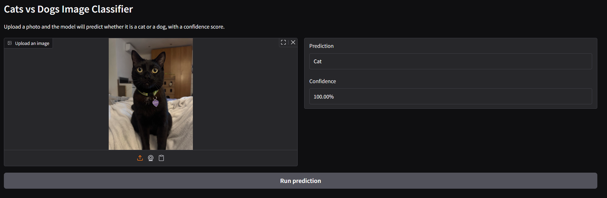
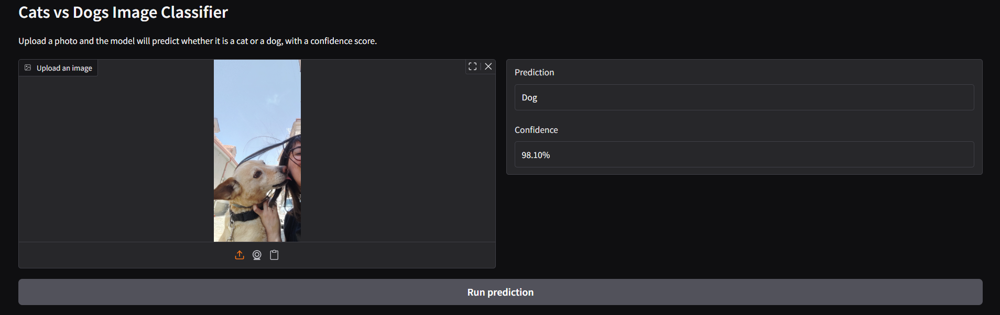

# Cats vs Dogs Image Classifier (fastai + Gradio)

Simple, portfolio-ready demo that classifies pet images as **Cat** or **Dog** using a fastai vision model and a clean Gradio UI.

## What this app does
- Upload an image
- See the uploaded preview
- Get a clear prediction (Cat/Dog)
- See the confidence score

## Model
- Framework: fastai
- Architecture: ResNet34 (transfer learning)
- Dataset: Oxford-IIIT Pets (37 breeds)
- Labels: Cat/Dog categories derived from the dataset's breed naming convention

## Results
| epoch | train_loss | valid_loss | error_rate | time |
| --- | --- | --- | --- | --- |
| 0 | 0.179958 | 0.020274 | 0.006089 | 04:20 |

| epoch | train_loss | valid_loss | error_rate | time |
| --- | --- | --- | --- | --- |
| 0 | 0.049542 | 0.012951 | 0.006089 | 05:52 |

## Project structure
```
.
├── app.py
├── inference.py
├── requirements.txt
├── model/
│   ├── cat_dog_classifier.pkl  # binary Cat/Dog classifier derived from breed names
│   └── labels.json
└── scripts/
    └── train.py
```

## Run locally
1. Install dependencies:
   ```bash
   pip install -r requirements.txt
   ```
   If your environment blocks `download.pytorch.org`, install torch/torchvision manually and then re-run the command.
2. Train/export the model (once):
   ```bash
   python scripts/train.py
   ```
   If you hit multiprocessing/pickle errors on newer Python versions, keep the default `NUM_WORKERS=0` or set it explicitly:
   ```bash
   NUM_WORKERS=0 python scripts/train.py
   ```
3. Start the app:
   ```bash
   python app.py
   ```
4. Open the local Gradio URL in your browser.

## Hugging Face Spaces (Gradio)
This repo is ready for Spaces.

1. Create a new **Gradio** Space.
2. Upload/push this repository.
3. Ensure these files are in the repo root:
   - `app.py`
   - `requirements.txt`
   - `model/cat_dog_classifier.pkl` (exported by running `python scripts/train.py`)
4. The Space will build automatically and serve the demo.

## Demo
Deployed version: https://huggingface.co/spaces/Jexy15/cats-vs-dogs-fastai

Screenshot:



## Notes & common pitfalls checked
- Inference uses fastai `load_learner` so preprocessing matches training.
- Class mapping is defined in `model/labels.json`.
- Model runs on CPU by default.

## Dataset download note
`scripts/train.py` downloads the Oxford-IIIT Pets dataset from fastai's public URL. If you run this in a restricted network, ensure that the dataset host is reachable or download the dataset manually and set `PETS_DATASET_PATH` to the extracted `images/` folder before training.
